[TOC]
# 1 车牌检测
## 1.1 通过轮廓初步定位

待识别的原始图像：
<div align=center>

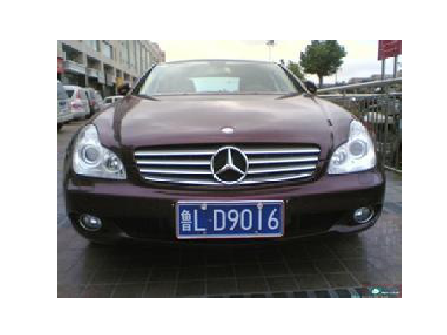
</div>

对输入的待识别图像进行高斯模糊，去除噪声：
</br>

```python
img = cv2.GaussianBlur(img, (blur, blur), 0)
```

将三通道的彩色图像转化为灰度图像：

```python
img = cv2.cvtColor(img, cv2.COLOR_BGR2GRAY)
```


<div align=center>

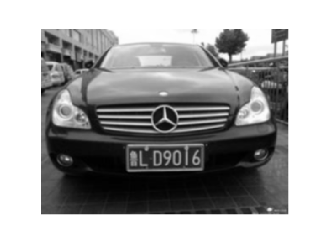
</div>

形态学开运算：
```python
img_opening = cv2.morphologyEx(img, cv2.MORPH_OPEN, kernel)#形态学开运算
```

<div align=center>

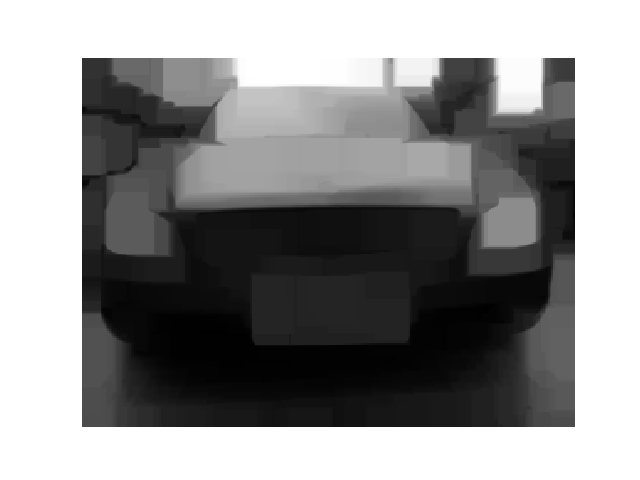
</div>

将高斯模糊后的灰度图像，与开运算后的灰度图像相减：
```python
img_opening = cv2.addWeighted(img, 1, img_opening, -1, 0)
```
<div align=center>

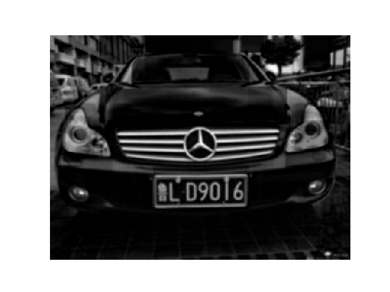
</div>

提取图像边缘：
```python
ret, img_thresh = cv2.threshold(img_opening, 0, 255, cv2.THRESH_BINARY + cv2.THRESH_OTSU)#大津阈值
img_edge = cv2.Canny(img_thresh, 100, 200)#canny算子提取边缘
```

<div align=center>

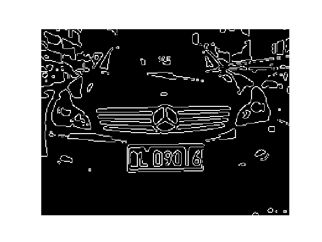
</div>

再将边缘进行整合，使用形态学开运算和闭运算的组合,将零散的多个小边缘聚合为大边缘，从而减少边缘数量：
```python
#边缘整体化，使用开运算和闭运算整合图像边缘
kernel = np.ones((self.cfg["morphologyr"], self.cfg["morphologyc"]), np.uint8)
img_edge1 = cv2.morphologyEx(img_edge, cv2.MORPH_CLOSE, kernel)
img_edge2 = cv2.morphologyEx(img_edge1, cv2.MORPH_OPEN, kernel)
```
<div align=center>

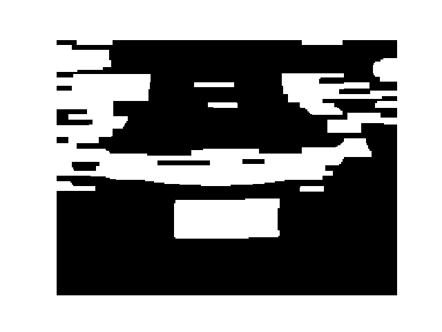
</div>

使用opencv的函数提取图像边缘：
```python
image, contours, hierarchy = cv2.findContours(img_edge2, cv2.RETR_TREE, cv2.CHAIN_APPROX_SIMPLE)
```
<div align=center>

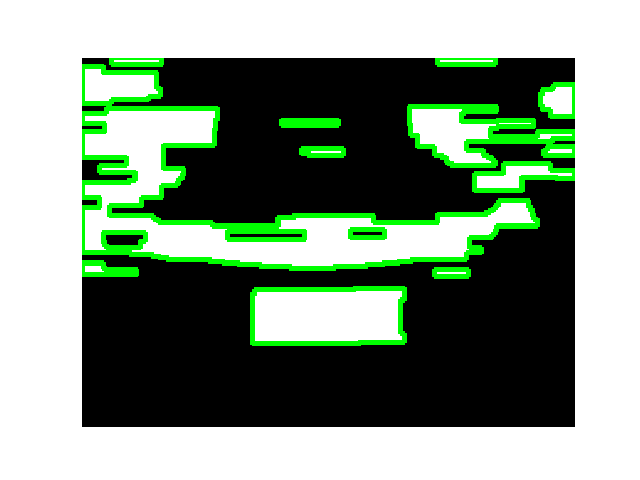
</div>

需要提前设置一个车牌最小面积的阈值，若提取出的边缘所包围的面积小于这个阈值，则认为该轮廓不属于车牌。通过这种方式，可以减少接下来要处理轮廓的数量：
<div align=center>

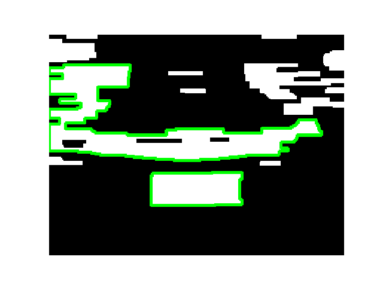
</div>

对于提取出的边缘，对每个独立的边缘，作它的最小外接矩形，可能会得到多个这样的矩形，车牌就在其中一个矩形区域里：
```
rect = cv2.minAreaRect(cnt)
```
对于得到的矩形区域，先计算一下每个矩形的长宽比。根据先验知识，认为车牌区域外接矩形的长宽比在2至5.5之间，将长宽比不在这个范围内的矩形剔除，得到车牌候选矩形区域：
<div align=center>

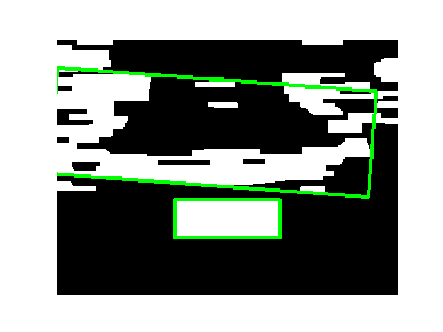
</div>

<div align=center>

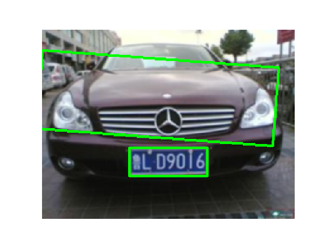
</div>

## 1.2 车牌区域仿射变换

实际成像过程是一个射影变换，原本为矩形的车牌，经过成像后往往不再是一个矩形：
<div align=center>

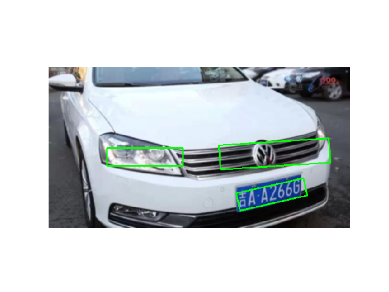
</div>
通过选取3个控制点，利用opencv中的函数得到仿射变换矩阵，对原图像进行仿射变换，能在一定程度上将倾斜的车牌图像拉正：
```python
M = cv2.getAffineTransform(pts1, pts2)
dst = cv2.warpAffine(oldimg, M, (pic_width, pic_hight))
```
<div align=center>

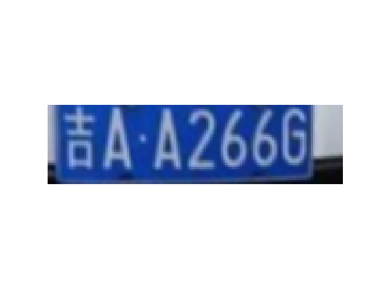
</div>
但是需要注意的是，只有当车牌图像在垂直于车牌平面的方向没有较大旋转时，直接使用仿射变换才能取得较好效果，否则会使图像产生较大畸变。这种情况下，应当先把车牌图像旋转一个角度，然后再进行仿射变换。

## 1.3 通过车牌颜色再定位
### 1.3.1 HSV颜色空间

hsv颜色空间由色调（Hue）、饱和度（Saturation）和亮度（Value）三个分量构成，HSV空间更接近与人眼的主管感受。之所以不使用RGB颜色模型，对车牌颜色进行识别，是因为RGB颜色模型在颜色处理中的局限性。在RGB颜色空间中，若要确定颜色，需要考虑R、G、B三个分量的配比，这会导致使用RGB模型进行颜色判别难度太大。而对于HSV模型，色调分量H是HSV模型中唯一跟颜色本质相关的分量，只要固定了H的值，并且保持S和V分量不太小，那么表现的颜色就会基本固定。

<div align=center>

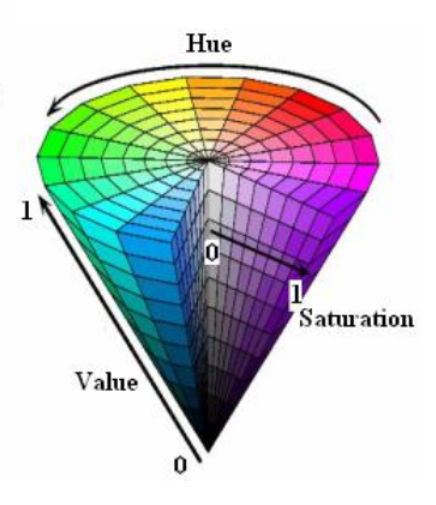
</div>


一般对图像颜色进行有效处理，都是在HSV空间进行的。对于基本色对应的颜色分量，要给定一个严格的范围，一般来讲，HSV的取值范围为：</br>

<div align=center>

&emsp;H:&emsp;0~360 </br>

&emsp;S:&emsp;0~100</br>

&emsp;V:&emsp;0~100</br>


</div>

而opencv中HSV的取值范围有所不同，下表是从网上获取的实验计算的模糊范围：<br>

<div align=center>

&emsp;H:&emsp;0~180</br>

&emsp;S:&emsp;0~255</br>

&emsp;V:&emsp;0~255</br>

</div>
基本颜色的HSV分量范围：

<div align=center>

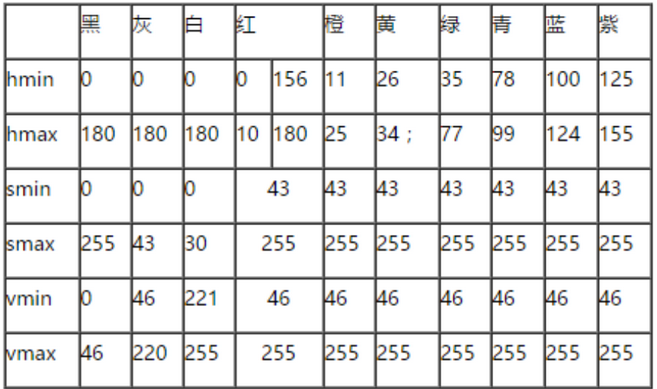
</div>

### 1.3.2 通过车牌颜色精确定位
对于可能是车牌区域的矩形，可以进一步通过其颜色特征进行判别。首先将三通道的矩形图像转换到HSV空间，遍历车牌图像中的每一个像素，判断其所属的颜色类别，目前仅仅识别3种颜色的车牌：蓝牌、绿牌和黄牌。若车牌图像的所有像素中，某个颜色的像素个数占了半数以上，则将车牌颜色判定为该颜色。若无法判定车牌颜色为蓝、绿、黄3种颜色中的某一个时，认为该矩形区域图像不是车牌。

确定了车牌颜色后，可利用该颜色信息，收缩车牌的边缘，获得更加精确的车牌边缘。收缩车牌变换的部分封装为了一个函数：
```python
#根据颜色信息精确定位车牌位置
def accurate_place(self, card_img_hsv, limit1, limit2, color):
    #函数内容此处省略
```
仿射变换后的车牌图像：
<div align=center>


</div>
收缩边界后的车牌图像：
<div align=center>

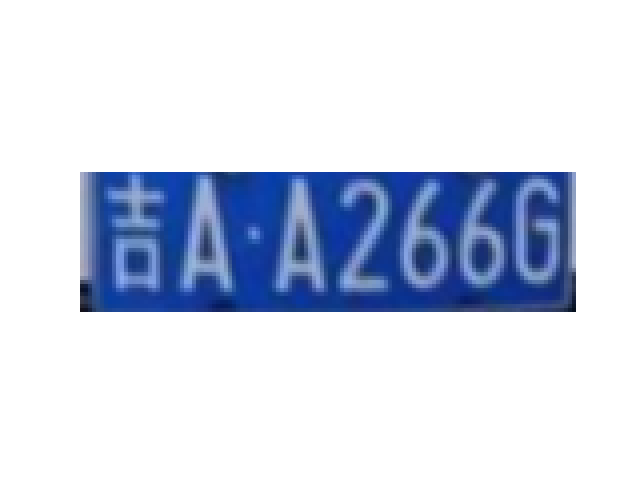
</div>

# 2 车牌字符分割
提取出车牌图像后，要将车牌图像中的字符进行分割，然后对分割出来的字符，逐一进行识别。
首先将三通道的彩色车牌图像转化为灰度图像：
```python
#将三通道的彩色车牌图像转换为灰度图像
gray_img = cv2.cvtColor(card_img, cv2.COLOR_BGR2GRAY)
```
然后将灰度图像二值化：
```python
#车牌图像二值化
ret, gray_img = cv2.threshold(gray_img, 0, 255, cv2.THRESH_BINARY + cv2.THRESH_OTSU)
```
<div align=center>

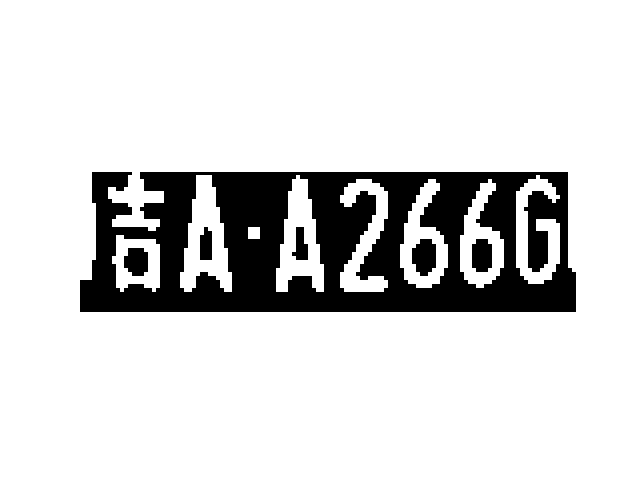
</div>

对于二值化后的车牌图像，将每一行像素的灰度值相加，从而把表示车牌图像的矩阵压缩为一列：
```python
#参数axis为1表示压缩列，将每一行的元素相加，将矩阵压缩为一列
x_histogram  = np.sum(gray_img, axis=1)
```
把每一行像素的灰度值之和画图表示出来：
<div align=center>


</div>
波峰所在区域可以认为是车牌中字符所在区域，这样可以进一步精确定位字符所在区域：
<div align=center>

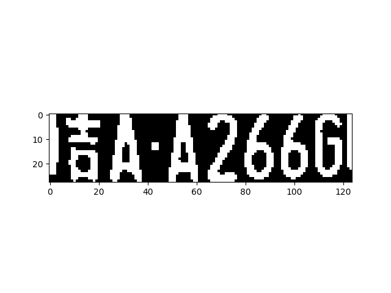
</div>


对于以上更加精确定位字符区域的二值化车牌图像，也可以把每一列像素的灰度值相加，从而把表示车牌图像的矩阵压缩为一行：
```python
#参数axis为0表示压缩列，将每一列的元素相加，将矩阵压缩为一行
y_histogram = np.sum(gray_img, axis=0)
```
把每一列像素的灰度值之和画图表示出来：
<div align=center>

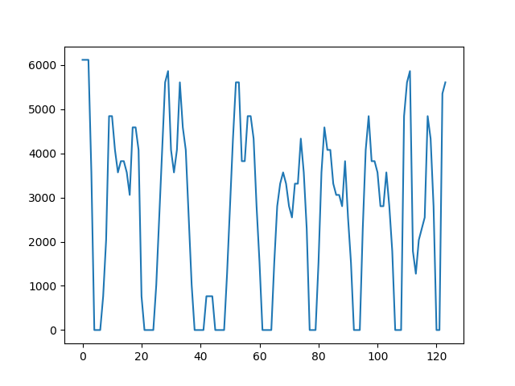
</div>
统计上图中波峰的数量，如果波峰的划分合适，那么一个波峰就对应着一个字符。而在实际处理过程中，一个字符可能对应一个波峰，但是也可能是由多个波峰组成,这取决于波峰是如何定义的。而且车牌的左右白色边缘也会形成两个波峰，这也可能造成错误分割。

目前的分割结果：
<div align=center>

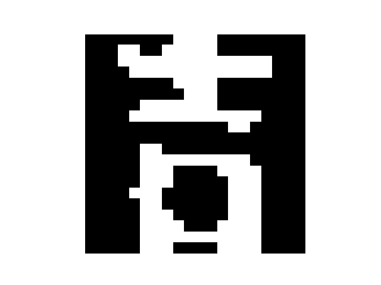
</div>

<div align=center>

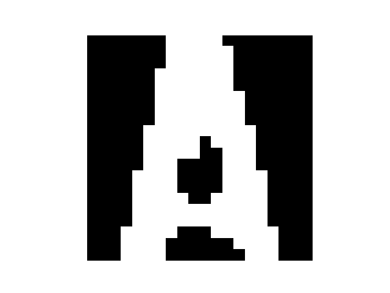
</div>

<div align=center>

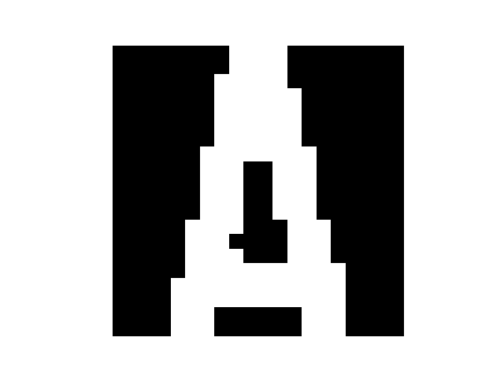
</div>

<div align=center>

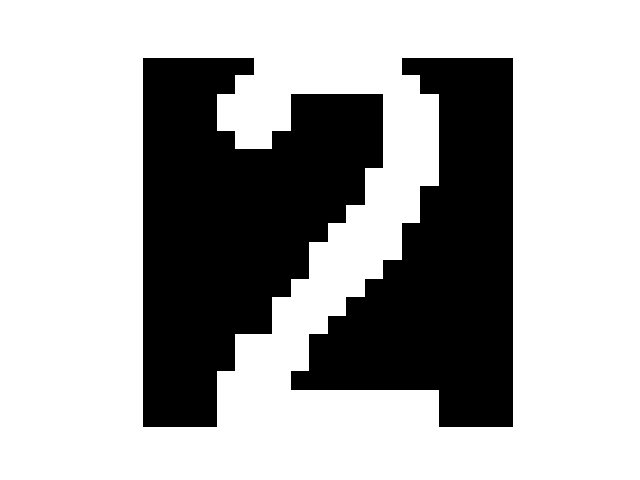
</div>

<div align=center>

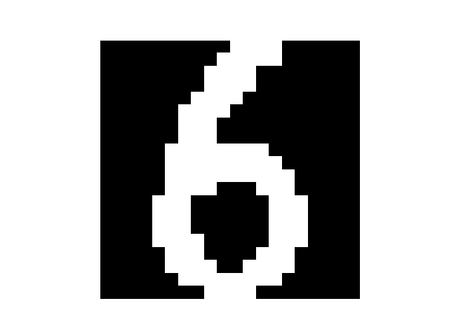
</div>

<div align=center>

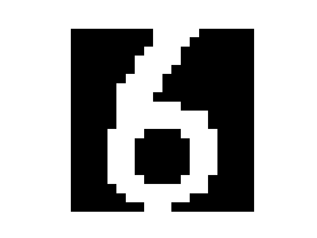
</div>

<div align=center>


</div>

# 3 车牌字符识别
字符识别使用SVM,代码来自opencv附带的sample,StatModel类和SVM类都是sample中的代码。SVM训练使用的训练样本来自于github上的easyPR的c++版本。
车牌字符识别结果：
<div align=center>

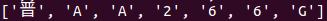
</div>
从识别结果来看，第一个汉字应该是吉林的“吉”，但是却被识别成了“晋”，剩下的字母和数字全部识别正确。


# 4 识别正确率及分析

## 4.1 识别正确率
对20张图片中的车牌进行识别，计算识别正确率：

| 待识别图片| 识别结果 | 正确与否 |
| :- | :- | :-: |
| 京A 88731.jpg | 京A 88731 | 正确 |
| 京A D77972.jpg | 京A D77972 | 正确 |
| 京A G6104.jpg | 京A G61U4 | 错误 |
| 京E 51619.jpg | 京E 51619 | 正确 |
| 京H 99999.jpg | 京H 99999 | 正确 |
| 吉A A266G.jpg | 晋A A266G | 错误 |
| 川A 88888.jpg | 川A 88888 | 正确 |
| 川A A662F.jpg | 川A A662E | 错误 |
| 浙A C1847.jpg | 鲁A C1847 | 错误 |
| 浙E 6686V.jpg | 浙E 6686V | 正确 |
| 皖A 85890.jpg | 识别失败   | 错误 |
| 皖A 87271.jpg | 皖A 87271 | 正确 |
| 皖A TH859.jpg | 桂A 1TH859 | 错误 |
| 皖A UB816.jpg | 皖A UB816 | 正确 |
| 粤E 9R439.jpg | 粤E 9R439 | 正确 |
| 豫C 66666.jpg | 川U 0D000 | 错误 |
| 鄂F AV888.jpg | 鄂F AV888 | 正确 |
| 鲁L D9016.jpg | 川1 D9016 | 错误 |
| 鲁Q 521MZ.jpg | 鲁0 521MZ | 错误 |
| 鲁Y 44748.jpg | 冀Y 44748 | 错误 |
共20张待识别图像，其中10张识别正确，10张识别错误，正确率为50%。

## 4.2 识别错误的原因分析
### 4.2.1 未提取到车牌
<div align=center>

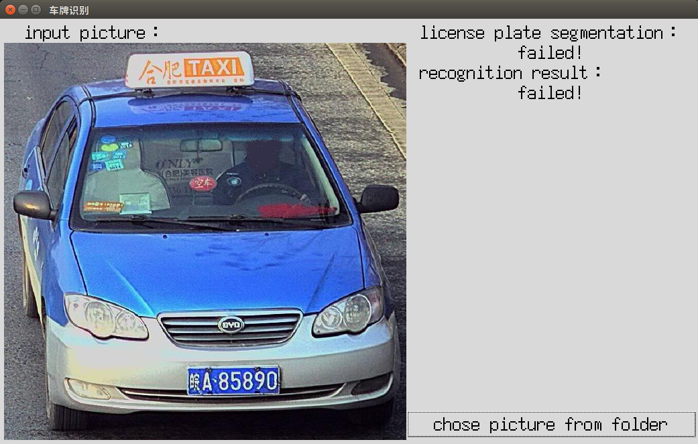
</div>
如上图所示，测试集中的这幅图片识别失败，原因是未提取到车牌区域：
<div align=center>


</div>
在本识别程序中，车牌的初次检测是依靠轮廓信息，提取的轮廓信息如下图所示：
<div align=center>

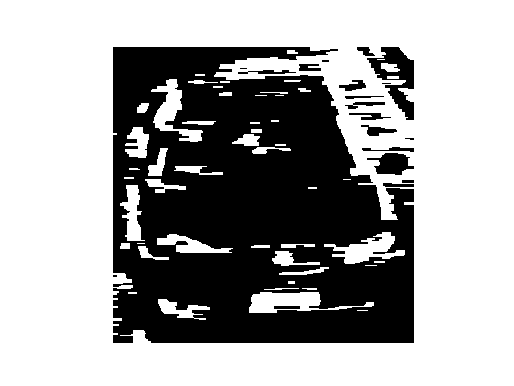
</div>
车牌所在的轮廓，被预设的一些限制条件排除掉了。这说明，本程序的车牌检测模块存在一定问题：一是初次检测时仅使用轮廓信息，不够靠谱；二是程序中存在一些预先设定的参数，这些参数设定的好坏影响到车牌检测的鲁棒性。

### 4.2.2 车牌提取不完整
<div align=center>

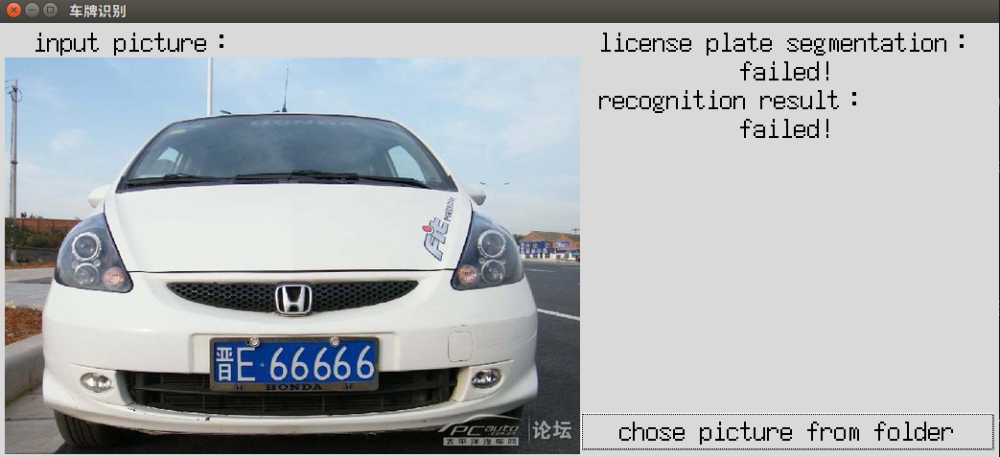
</div>
如上图所示，测试集中的这幅图片识别失败，原因是车牌提取不完整：
<div align=center>

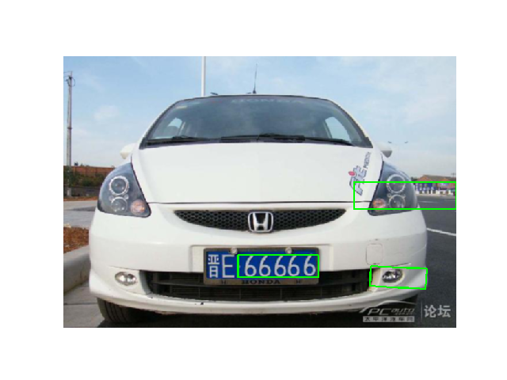
</div>
再看看处理过程中的轮廓图：
<div align=center>

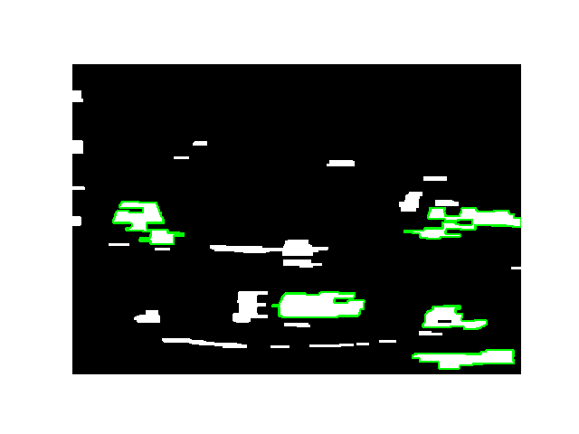
</div>
从图中可以发现，由于车牌的前两个字符与后面的字符之间存在一个间隔，在图像的形态学处理过程中，处理不合适，所以没有将整个车牌区域连成一个整体。

### 4.2.3 字符分割错误
车牌图像在二值化后，车牌左右两边会出现白条，可能会被错认为字符的一部分：
<div align=center>

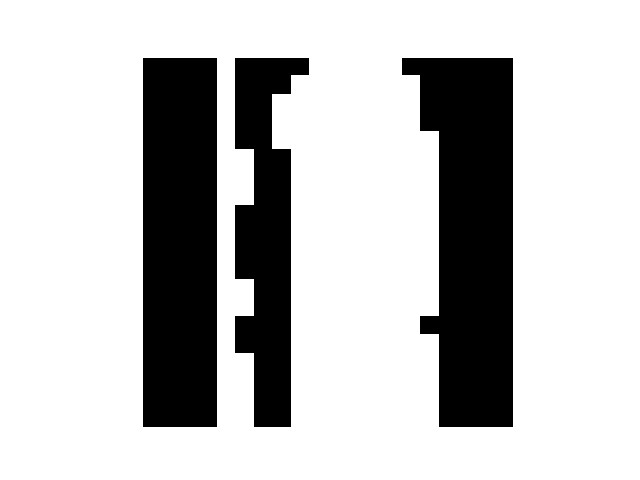
</div>
此外，由于程序中使用像素亮度的波峰进行字符分割，所以如果定义波峰的阈值设置不合理，则字符分割很容易受到噪声干扰，某些字符可能会被分割为多个部分，比如字符“U”。

### 4.2.4 汉字识别错误率较高
汉字识别错误率高，有多个原因，可能是因为字符分割错误：
<div align=center>


</div>
也可能是因为分割出来的字符二值图像分辨率过低，导致字符变成了一个亮团：
<div align=center>


</div>
还有一个原因是，字符识别使用了SVM，训练数据来自github上的车牌识别项目easyPR，而该训练数据的量不一定足，而且分类器SVM本身也存在一定的局限性。

# 5 车牌识别GUI
运行surface.py，会开启一个车牌识别的GUI：
<div align=center>

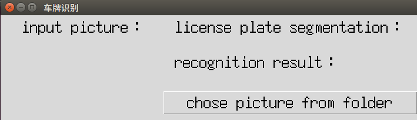
</div>
点击“chose picture from folder”会弹出一个对话框，用于从文件系统中选取待识别的图像：
<div align=center>

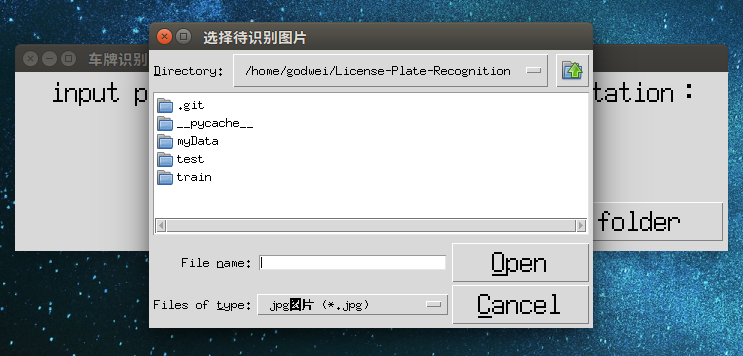
</div>

打开待识别的图像后，会显示分割出的车牌图像和识别结果：
<div align=center>

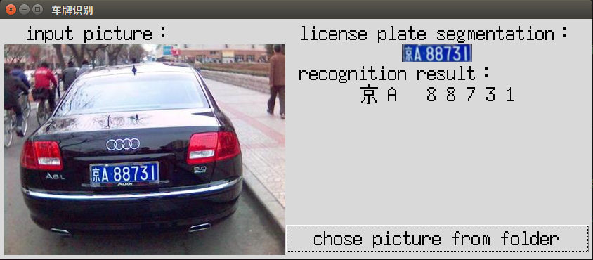
</div>